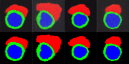
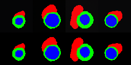

# Prim_diffusion

## Prepare

1. Clone the repository

   ```shell
   git clone ...
   cd prim_diffusion
   mkdir data ckpt output logs
   ```

2. Download Dataset:

   ```shell
   ACDC_DOWNLOAD_LINK=https://humanheart-project.creatis.insa-lyon.fr/database/api/v1/collection/637218c173e9f0047faa00fb/download
   
   wget $ACDC_DOWNLOAD_LINK -O acdc.zip
   mkdir data
   unzip acdc.zip -d data/ACDC/
   ```

3. Pre-process -- (convert to h5file format, split train/val/test)

   ```shell
   cd src/task
   python 01preprocess_dataset.py --data_dir ../../data/ACDC/ --output_dir ../../data/ACDC/
   
   python 04split_csv_by_ID.py ../../data/ACDC/quadra/quadra_per_slice_train.csv 
   ```

4. **(Optional)** Download pretrained vae (SD3.5-large) model

   ```shell
   cd ../../ # go back to project root directory
   VAE_DOWNLOAD_LINK=https://huggingface.co/stabilityai/stable-diffusion-3.5-large/resolve/main/vae/diffusion_pytorch_model.safetensors?download=true
   
   wget $VAE_DOWNLOAD_LINK -O config/vae/diffusion_pytorch_model.safetensors
   ```

## Training

### DDPM

```shell
cd src/task/

# default setting
CUDA_VISIBLE_DEVICES=0 python 10train_shapedm_guidance.py --config ../../config/training/dm_medium.yaml 

# override by command line:
CUDA_VISIBLE_DEVICES=0 python 10train_shapedm_guidance.py --config ../../config/training/dm_medium.yaml max_epoches=100 optimizer.lr=0.001
```


### LDM

```shell
cd src/task/

# default setting
CUDA_VISIBLE_DEVICES=0 python 11train_shapeldm_guidance.py --config ../../config/training/ldm_medium.yaml 

# override by command line:
CUDA_VISIBLE_DEVICES=0 python 11train_shapeldm_guidance.py --config ../../config/training/ldm_medium.yaml max_epoches=100 optimizer.lr=0.001
```


## Inference

### DDPM

```shell
CUDA_VISIBLE_DEVICES=0 python 07inference_guide.py \
   --ckpt_path XXXX \
   --config_dir ../../config/model/dm_medium/ \
   --batch_size 64 \
   --total_num 1024 \
   --output_type "numpy" \
   --guidance_scale 7.5 \
   --num_inference_steps 1000 \
   --output_dir ../../output/ \
```

### Latent DM
```shell
CUDA_VISIBLE_DEVICES=0 python 07inference_guide.py \
   --ckpt_path XXXX \
   --config_dir ../../config/model/ldm_large/ \
   --batch_size 64 \
   --total_num 1024 \
   --output_type "numpy" \
   --guidance_scale 7.5 \
   --num_inference_steps 1000 \
   --output_dir ../../output/ \
   --latent
```

---

### Inference samples

**ShapeDM Medium 64**



**Conditional ShapeDM Medium 64**



---

---


## Checkpoint

### 20241211-123623_02train_ddpm_medium
```yaml
opts:
  desc: null
  value: Namespace(batch_size=64, warmup_epochs=20, max_epochs=200, from_epoch=0,
    num_workers=8, device_num=1, unet_config='../../config/ddpm_medium/unet/', scheduler_config='../../config/ddpm_medium/scheduler/',
    img_size=64, img_root='.', data_root='../../data/ACDC/quadra/', in_channels=1,
    out_channels=1, ckpt=None, ckpt_dir='../../ckpt/prim/', log_dir='../../logs/',
    log_step=1, config_dir='../../config/', lr=1e-05, accumulate_grad_batches=1, project='prim',
    ps='medium', fast=False, save_training_output=False, frozen=False, reuse=False)
```

FID-convention: raw-train binarization-train, raw-test, binarization-test
sub output:
    - 20241212-200716
        - fid: 266.1， 64.6, 276.4 ,82.0 

### 20241225-091144_05train_ddpm_class_guidance_debug


opts:
  desc: null
  value: Namespace(batch_size=16, warmup_epochs=20, max_epochs=200, from_epoch=0,
    num_workers=8, device_num=1, unet_config='../../config/ddpm_medium/unet_class/',
    scheduler_config='../../config/ddpm_medium/scheduler/', img_size=128, img_root='.',
    data_root='../../data/ACDC/quadra/', in_channels=1, out_channels=1, ckpt=None,
    ckpt_dir='../../ckpt/prim/', log_dir='../../logs/', log_step=5, config_dir='../../config/',
    lr=0.0001, accumulate_grad_batches=1, project='prim', ps='debug', fast=False,
    save_training_output=False, frozen=False, reuse=False, p_uncond=0.5, p_uncond_label=10)

sub output:
    - 

### 20250116-141853_05train_ddpm_class_guidance_64_medium
sub output:
    - 20250121-032322
        - fid: 44.5, 14.4, 56.4,  26.5

### 20250215-103402

- 20250224-145046， guidance = 1   : 231.8, 14.4,  221,7,  90.0
- 20250224-171628 guidance = 7.5  :


### 20250215-000946_11train_shapeldm_guidance_resume_092933

- 20250225-123615 guidance = 1, shapeldm medium


### 20250215-000946 ShapeLDM Medium
- 20250226-025508   : 238.6, 136.1, 224.7, 116.8

### 20250215-000948 ShapeLDM Medium2
- 20250226-025438  : 253.5, 132.3, 235.6, 110.4

### 20250215-000943 ShapeLDM Large
- 20250226-030220  ： 228.6, 116.3, 216.3， 92.1
